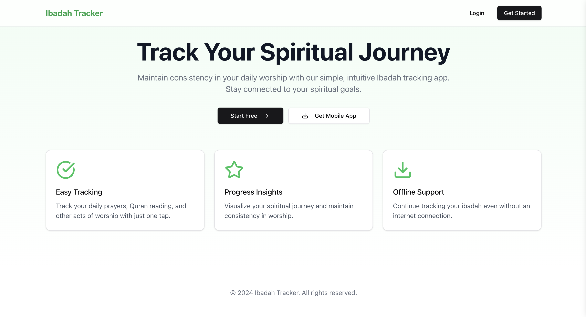

# Ibadah Tracker

A modern web application for tracking daily Islamic worship and maintaining spiritual consistency.



## Features

- 🕌 **Daily Worship Tracking**: Track salah, dhikr, Quran reading, and custom ibadah
- 📊 **Progress Visualization**: View detailed progress charts and statistics
- 🌐 **Multilingual**: Supports English and Arabic
- 💾 **Offline Support**: Continue tracking without internet connection
- 📱 **Responsive Design**: Works seamlessly across all devices
- 🔒 **Privacy Focused**: Local-first data storage with end-to-end encryption

## Tech Stack

- **Frontend**: Next.js 14 with App Router
- **UI Components**: shadcn/ui
- **Styling**: Tailwind CSS
- **State Management**: React Hooks
- **Charts**: Recharts
- **Icons**: Lucide React

## Prerequisites

- Node.js 18.17 or later
- MongoDB (for backend)
- npm or yarn

## Installation

1. Clone the repository:
```bash
git clone https://github.com/yourusername/ibadah-tracker.git
cd ibadah-tracker
```

2. Install dependencies:
```bash
npm install
# or
yarn install
```

3. Set up environment variables:
```bash
cp .env.example .env.local
```

Edit `.env.local` with your configuration:
```
NEXT_PUBLIC_API_URL=http://localhost:5000/api
```

4. Start the development server:
```bash
npm run dev
# or
yarn dev
```

The app will be available at `http://localhost:3000`.

## Project Structure

```
src/
├── app/                 # App Router components and routes
├── components/         # Reusable UI components
│   ├── ui/            # shadcn/ui components
│   └── custom/        # Custom components
├── lib/               # Utility functions and API clients
│   └── api/          # API integration
├── styles/           # Global styles
└── types/            # TypeScript type definitions
```

## Key Components

- `LandingPage`: Main marketing page
- `AuthPage`: User authentication
- `IbadahTracker`: Core tracking functionality
- `ProgressView`: Progress visualization
- `SettingsView`: User preferences
- `AddCustomIbadahModal`: Custom ibadah creation

## API Integration

The frontend connects to a REST API with these main endpoints:

- `/auth`: Authentication and user management
- `/ibadah`: Ibadah tracking operations
- `/progress`: Progress and statistics
- `/settings`: User preferences

## Development

### Code Style

- Follow Next.js and React best practices
- Use TypeScript for type safety
- Follow Tailwind CSS class ordering conventions
- Implement responsive design with mobile-first approach

### Commands

```bash
# Development
npm run dev

# Type checking
npm run type-check

# Linting
npm run lint

# Build
npm run build

# Start production server
npm start
```

## Testing

```bash
# Run tests
npm test

# Watch mode
npm run test:watch
```

## Deployment

1. Build the application:
```bash
npm run build
```

2. The app can be deployed to Vercel:
```bash
vercel deploy
```

## Contributing

1. Fork the repository
2. Create your feature branch (`git checkout -b feature/AmazingFeature`)
3. Commit your changes (`git commit -m 'Add some AmazingFeature'`)
4. Push to the branch (`git push origin feature/AmazingFeature`)
5. Open a Pull Request

## License

This project is licensed under the MIT License - see the [LICENSE](LICENSE) file for details.

## Acknowledgments

- [Next.js](https://nextjs.org)
- [shadcn/ui](https://ui.shadcn.com)
- [Tailwind CSS](https://tailwindcss.com)
- [Recharts](https://recharts.org)
- [Lucide Icons](https://lucide.dev)